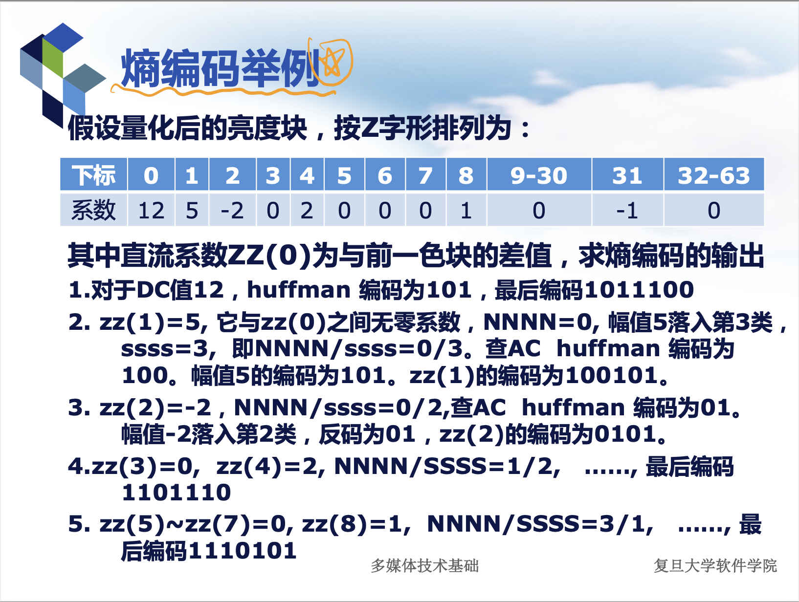

# 多媒体技术基础 PJ3

> 19302010021 张皓捷

## 编译工具链

我测试了以下编译工具链。

### Windows

CMake 3.24.3

```powershell
cmake version 3.24.2
CMake suite maintained and supported by Kitware (kitware.com/cmake).
```

gcc 11.2.0

```
gcc version 11.2.0 (MinGW-W64 x86_64-posix-seh, built by Brecht Sanders)
```

 GNU Make 4.3 （mingw32-make ）

```
GNU Make 4.3
Built for x86_64-w64-mingw32
```

### macOS

CMake 3.23.1

```
cmake version 3.23.1
CMake suite maintained and supported by Kitware (kitware.com/cmake).
```

Apple clang 14.0.0

```
Apple clang version 14.0.0 (clang-1400.0.29.202)
Target: arm64-apple-darwin22.1.0
```

GNU Make 3.81

```
GNU Make 3.81
Copyright (C) 2006  Free Software Foundation, Inc
```

## 编译方法

在bmp2jpeg_cmake目录下

```shell
cmake -S . -B ./my_build && cmake --build ./my_build
```

## JPEG编码过程的详细说明

将BMP图像转换为JPEG图像的过程，大致可以用以下伪代码描述。

```
写入jpeg文件（头部 markers）

bmp_data = 从硬盘上读取图像test.bmp

bmp_data = 长和宽补齐成8的倍数(bmp_data)

mcu_list = 将bmp_dat分割成若干个8*8*3的最小单元 //其中第1个8、第2个8是最小单元的长宽，3为RGB颜色的通道数

对mcu_list中的每个mcu:

    mcu = 转换成YCbCr颜色（mcu)
    
    对mcu中的Y、Cb、Cr三个通道channel：
        
        channel = fct(channel) // 离散余弦变换
        
        channel = quant(chennel) // 量化
        
        channel = zigzag(channel) // zig-zag编码
        
        channel.dc = DPCM(channel.dc) // 对DC分量进行DPCM编码
        
        channel.ac = RLE(channel.ac) // 对AC分量进行RLE编码
        
        channel = huffman(channel) // 对channel进行熵编码（哈夫曼编码）
        
        写入jpeg文件(channel) // 将channel写入文件

写入jpeg文件（EOT marker）
```

### 我的具体实现

#### 将BMP文件读取到内存中，并把长和宽补齐成8的倍数

使用`bmp_complemented`这个结构存储长和宽补齐成8的倍数后的BMP图像数据。

```c
/**
 * 经过8*8补齐的bmp数据。
 * realWidth和realHeight是bmp图像的原始宽度和长度
 * complementedWidth和complementedHeight是bmp图像补齐到8的倍数以后的宽度和长度
 * 而data的长度和宽度是经过补齐到8的倍数的
 * 例如，如果有一个10*10的bmp图像，则realWidth=realHeight=10，而data是一个16*16=256的数组
 */
struct bmp_complemented {
    UINT32 realWidth;
    UINT32 realHeight;
    UINT32 complementedWidth;
    UINT32 complementedHeight;
    UINT32 i; // 当前在垂直方向，迭代到第几个MCU了
    UINT32 j; // 当前在水平方向，迭代到几个MCU了
    struct rgb_unit *data;
};
```

具体的读取逻辑，写在`huajuan/huajuan_bmp.c`的`read_bmp_data`函数中。

#### 将BMP图像分割成MCU，并对MCU进行迭代

使用`mcu`这个结构代表一个MCU。

```c
/**
 * 一个8*8*3的MCU
 * 数据格式为
 * (0,0)B, (0,0)G, (0,0)R, (0,1)B, (0,1)G, (0,1)R.......
 */
struct mcu {
    UINT8 *rgbData; // length：8*8*3
}
```

具体的迭代mcu的逻辑，写在`huajuan/huajuan_bmp.c`的`next_mcu`函数中。

#### 将RGB颜色转换成YCbCr颜色

具体在`cjpeg.c`文件的`rgb_to_ycbcr`函数中。

#### 离散余弦变换

具体在`fdctflt.c`文件的`jpeg_fdct`函数中。

#### 量化

具体在`cjpeg.c`文件的`jpeg_quant`函数中。

#### Zig-Zag编码、对DC分量使用DPCM编码、对AC分量使用RLE编码、对DC和AC分量进行哈夫曼编码

具体在`cjpeg.c`文件的`jpeg_compress`函数中。

```c
/*
 * compress JPEG
 * data: data[64]，经过离散余弦变换和量化的某个颜色分量
 * dc: int * dc，指向【上一个相同颜色分量mcu的dc系数】的指针
 * dc_htable，ac_htable：dc和ac分量对应的哈夫曼表
 */
void
jpeg_compress(compress_io *cio,
              INT16 *data, INT16 *dc, BITS *dc_htable, BITS *ac_htable) {
    INT16 zigzag_data[DCTSIZE2];
    BITS bits;
    INT16 diff;
    int i, j;
    int zero_num;
    int mark;

    /* zigzag encode */
    // zig-zag 编码
    for (i = 0; i < DCTSIZE2; i++)
        zigzag_data[ZIGZAG[i]] = data[i];

    /* write DC */
    // 写入DC
    diff = zigzag_data[0] - *dc;
    *dc = zigzag_data[0];

    if (diff == 0)
        // 先写【幅值所需要的位数】对应的哈夫曼码字
        write_bits(cio, dc_htable[0]);
        // 幅值所需要的位数是0，也就不写幅值了
    else {
        // 设置bits变量，存储了【幅值】所需要的位数，和幅值的码字
        set_bits(&bits, diff);
        // 写【幅值所需要的位数】对应的哈夫曼码字
        write_bits(cio, dc_htable[bits.len]);
        // 写【幅值】对应的码字
        write_bits(cio, bits);
    }

    /* write AC */
    // 写入AC
    int end = DCTSIZE2 - 1;
    while (zigzag_data[end] == 0 && end > 0)
        // "跳过"掉zig-zag后末尾的0
        end--;

    // 从1开始，因为下标为0的是直流分量，之前已经写过了
    for (i = 1; i <= end; i++) {
        j = i;
        // "跳过"连续的0
        while (zigzag_data[j] == 0 && j <= end)
            j++;
        zero_num = j - i; // 连续的0的数目

        // 如果连续的0超过16个，对于每连续的16个0，写入一个"1111/0000"对应的哈夫曼码字，用来表示16个0
        for (mark = 0; mark < zero_num / 16; mark++)
            write_bits(cio, ac_htable[0xF0]);
        // 剩下的连续的0的数量（不满16个）
        zero_num = zero_num % 16;
        // bits变量存储了【幅值】所需要的位数，和幅值的码字
        set_bits(&bits, zigzag_data[j]);
        // 高4位表示连续0的个数，低4位表示幅值的所需要的位数，转换成哈夫曼码字后写入文件
        write_bits(cio, ac_htable[zero_num * 16 + bits.len]);
        // 写入幅值对应的码字
        write_bits(cio, bits);
        i = j;
    }

    /* write end of unit */
    // 对于尾巴上连续的0，直接写入一个EOB(0/0)
    if (end != DCTSIZE2 - 1)
        write_bits(cio, ac_htable[0]);
}
```

### jpeg_encode的实现

```c
/*
 * main JPEG encoding
 */
void
jpeg_encode(compress_io *cio, bmp_info *binfo) {
    /* init tables */
    UINT32 scale = 50;
    init_ycbcr_tables();
    init_quant_tables(scale);
    init_huff_tables();

    /* write info */
    // 这里写入了SOI（Start Of Image）标记和APP0标记
    write_file_header(cio);
    // 这里写入了DQT（量化表）标记和SOF（Start Of Frame）标记
    write_frame_header(cio, binfo);
    // 这里写入了DHT（Define Huffman Table）标记和SOS（Start of Scan）标记
    write_scan_header(cio);

    // 把bmp的数据一次性读到内存里来
    struct bmp_complemented bmpComplemented;
    read_bmp_data(cio, binfo, &bmpComplemented);

    // 逐个从内存中的bmp图像中，迭代MCU
    struct mcu my_mcu;
    next_mcu(&bmpComplemented, &my_mcu);
    // 上一次的Y通道，Cb通道，Cr通道的Dc值
    INT16 lastYDc = 0;
    INT16 lastCbDc = 0;
    INT16 lastCrDc = 0;
    for (; my_mcu.rgbData != NULL; next_mcu(&bmpComplemented, &my_mcu)) {

        // 将RGB数据转换为YCbCr数据，将YCbCr的数据减去128的工作，也在这个函数里面完成了
        ycbcr_unit ycbcrUnit;
        rgb_to_ycbcr(my_mcu.rgbData, &ycbcrUnit, 0, DCTSIZE);

        // 离散余弦变换（对Y，Cb，Cr三个通道都进行离散余弦变换）
        jpeg_fdct(ycbcrUnit.y);
        jpeg_fdct(ycbcrUnit.cb);
        jpeg_fdct(ycbcrUnit.cr);

        // 将离散余弦变换的结果进行量化
        quant_unit quantUnit;
        jpeg_quant(&ycbcrUnit, &quantUnit);

        // jpeg压缩，并写入文件（分别对Y，Cb，Cr三个分量）
        jpeg_compress(cio,
                      quantUnit.y,
                      &lastYDc,
                      h_tables.lu_dc,
                      h_tables.lu_ac);
        jpeg_compress(cio,
                      quantUnit.cb,
                      &lastCbDc,
                      h_tables.ch_dc,
                      h_tables.ch_ac);
        jpeg_compress(cio,
                      quantUnit.cr,
                      &lastCrDc,
                      h_tables.ch_dc,
                      h_tables.ch_ac);


        // 更新"上一次的直流分量值"
        lastYDc = quantUnit.y[0];
        lastCbDc = quantUnit.cb[0];
        lastCrDc = quantUnit.cr[0];

        // 释放内存
        free_mcu_data(&my_mcu);
    }

    write_align_bits(cio);

    /* write file end */
    write_file_trailer(cio);

    free_bmp_data(&bmpComplemented);
}
```

## Huffman编码的原理

概括地来说，哈夫曼编码的原理是：<u>出现次数较多的码字用较短的01串表示，出现次数较少的码字用较长的01串表示。</u>

JPEG编码的过程中，在zig-zag编码、对DC系数进行DPCM编码、对AC系数进行RLE编码后，需要对DC系数和AC系数进行Huffman编码。

**JPEG编码中的Huffman编码（个人理解）**：编码的其实不是DC系数和AC系数的幅值，而是DC系数和AC系数的**元信息**。

例如PPT中描述的，Huffman编码的例子。



### 以DC系数为例

对于DC系数12：12这个幅值需要用4个bit才能表示（属于第4类），查哈夫曼表得到4对应的哈夫曼码字是101。之后在写入幅值12的码字，是1100，最后输出1011100。

这里并没有直接对幅值12进行哈夫曼编码，而是对【12需要用几个bit才能表示】（答案是4）进行哈夫曼编码。**可以认为哈夫曼编码的是DC系数的【元信息】**。

在编码了【12这个幅值需要用4bit表示】这个元信息后，之后再记录12这个幅值时，只需要写有效的4个bit，即1100就可以了。

将【元信息】和【有效的4个bit】结合起来，就是1011100，占用7个bit。比使用定长编码，直接写入12（0000000000001100），占用16个bit，省了很多空间。

### 对于AC系数

例如第一个AC系数5，它的元信息为0000/0011，低4位表示前面有0个连续的0，后4位表示5这个幅值需要用3个bit才能表示。

对0000/1111这个【元信息】进行编码，结果是100。之后再写入幅值5的码字，是101（3个有效bit）。组合起来就是100101，占用6个bit。比起定长编码占用16个bit，节省了很多空间。

## DCT的原理

DCT是一种正交变换编码方式，用于去除图像数据的空间冗余。

DCT变换能将8*8图像的空间表达转换为频率域。

从输入输出的角度来看，DCT变换是将一个8行8列的矩阵，转换成另一个8行8列的矩阵。

经过DCT后，转换后矩阵的能量主要集中在左上角少数几个系数上。DCT支持反变换（尽管是有损的），因此可以用少量的数据点就能表示整个8*8的图像。
